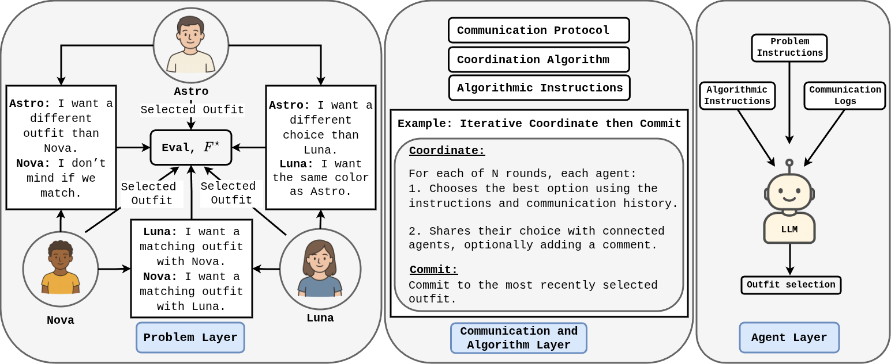

# CoLLAB — Coordinating LLM Agents Benchmark



CoLLAB is a small, practical framework for studying coordination among multiple LLM agents on cooperative tasks. It adapts the classic Distributed Constraint Optimization Problem (DCOP) paradigm to settings with natural‑language instructions and communication, and exposes a clean separation of concerns across three layers: problem (what to solve), communication/algorithm (how agents interact), and agent (how an LLM reasons and outputs a decision).

In short: CoLLAB brings DCOP‑style, quantitative coordination to LLMs, supports text and image instructions, and lets you vary difficulty by changing the problem, the protocol, or the agent’s reasoning style — while keeping an objective, symbolic backbone to measure progress.


## What’s in this repository

- Problem layer (problem_layer/)
  - Three coordination problems with a DCOP backbone + natural instructions:
    - personal_assistant (wardrobe coordination)
    - meeting_scheduling (attendance intervals)
    - smart_grid (energy source allocation)
  - Each problem exposes an evaluation schema and utility function, so you can score any joint assignment.

- Communication + Algorithm layer (communication_layer/)
  - Protocols for agent‑to‑agent interaction:
    - ICC_DM (decision‑only, Gauss–Seidel updates)
    - ICC_CoT (two‑phase: free‑text “thinking” then JSON decision)
    - ICC_NM (natural communication broadcast, then JSON decision)
    - ICC Image (vision‑aware planning prompt + JSON decision)

- Agent layer (agent_layer/)
  - CollaborativeAgent (JSON‑only) and ThinkingAgent (thinking → JSON), with schema validation and fallbacks.

- API clients (api_layer/)
  - VLLMServerAPI (REST/legacy) and OpenAIChatAPI wrappers.
  - Optional local vLLM servers you can run:
    - Text: `api_layer/vllm_server.py` (FastAPI)
    - Image: `api_layer/vllm_server_image.py` (FastAPI; embeds local files as data URLs)

- Symbolic baselines (symbolic_agents/)
  - Simple, transparent DCOP‑style solvers for each problem to provide quantitative reference solutions.

- Examples & Configs
  - Examples: `example00_generate.py`, `example01_symbolic.py`, `example02_run_vllm.py`, `example03_icc_dm.py`, `example04_icc_cot.py`, `example05_icc_nm.py`, `example06_icc_image.py`
  - Configs: `configs/problems.json` (text), `configs/problems_image.json` (image), `configs/vllm_server.json`, `configs/gpt_api.json`
  - One‑command demo runners: `example_run_vllm.sh`, `example_run_vllm_image.sh`, `example_run_gpt.sh`, `example_run_symbolic.sh`


## Quickstart

Choose one of the paths below (vLLM server or GPT). All examples also work with a “debug” provider (no network; mock responses) to inspect prompts end‑to‑end.

### 1) Generate instances (no LLM required)

Generate text‑mode instances (JSON + PKL):

```
python example00_generate.py configs/problems.json
```

Generate image‑enabled instances (requires Pillow):

```
python example00_generate.py configs/problems_image.json
```

### 2) vLLM (decision‑only, text)

One‑command runner:

```
./example_run_vllm.sh
```

Separate commands:

```
# Generate text instances
python example00_generate.py configs/problems.json

# Start server (text)
python example02_run_vllm.py --mode text --config configs/vllm_server.json >/tmp/vllm_server.log 2>&1 &

# Run ICC_DM on a saved instance (e.g., personal_assistant)
python example03_icc_dm.py outputs/examples/01_generate/personal_assistant \
  --provider vllm --provider-config configs/vllm_server.json --config-mode text --rounds 5
```

### 3) vLLM Image (vision‑aware planning)

One‑command runner:

```
./example_run_vllm_image.sh
```

Separate commands:

```
# Generate image instances (needs Pillow)
python example00_generate.py configs/problems_image.json

# Start server (image)
python example02_run_vllm.py --mode image --config configs/vllm_server.json >/tmp/vllm_server_image.log 2>&1 &

# Run ICC Image on a saved instance
python example06_icc_image.py outputs/examples/01_generate/personal_assistant \
  --provider vllm --provider-config configs/vllm_server.json --config-mode image --rounds 5
```

### 4) GPT (OpenAI Chat API)

One‑command runner:

```
./example_run_gpt.sh
```

Separate commands:

```
# Generate text instances
python example00_generate.py configs/problems.json

# Run ICC_DM via GPT using configs/gpt_api.json for key+model
python example03_icc_dm.py outputs/examples/01_generate/personal_assistant \
  --provider gpt --provider-config configs/gpt_api.json --rounds 5
```


## Examples (what each shows)

All examples print a concise result summary: total utility, min/max bounds (when available), and a normalized ratio.

- example00_generate.py — Generate and save instances
  - Reads sizes/seeds from `configs/problems.json` (optional).
  - Saves per‑problem JSON + PKL and prints counts: agents, variables, factors.

- example01_symbolic.py — Symbolic baselines on a saved instance
  - Run: `python example01_symbolic.py outputs/examples/01_generate/personal_assistant`
  - Useful for quick baselines or sanity checks.

- example02_run_vllm.py — Launch a local vLLM server from JSON config (text/image profile)
  - Text: `python example02_run_vllm.py --mode text --config configs/vllm_server.json`
  - Image: `python example02_run_vllm.py --mode image --config configs/vllm_server.json`

- example03_icc_dm.py — ICC_DM (decision‑only)
  - Providers: `vllm`, `gpt`, `debug`.
  - vLLM: `python example03_icc_dm.py <instance_dir> --provider vllm --provider-config configs/vllm_server.json --config-mode text`
  - GPT: `python example03_icc_dm.py <instance_dir> --provider gpt --provider-config configs/gpt_api.json`

- example04_icc_cot.py — ICC_CoT (thinking → JSON)
  - Providers: `vllm`, `gpt`, `debug`.
  - Uses batch thinking when supported; otherwise works sequentially.

- example05_icc_nm.py — ICC_NM (natural communication + JSON)
  - Adds a synchronous free‑text broadcast before decisions to coordinate agents.

- example06_icc_image.py — ICC Image (vision‑aware planning)
  - Uses images in the planning step (batch when supported; else sequential) and JSON for decisions.
  - Requires image‑enabled instances (use `configs/problems_image.json`).

- example05_icc_nm.py — ICC_NM (natural communication + JSON)
  - Adds a short free‑text broadcast before decisions to coordinate agents.


## Architecture overview

- Problem layer: symbolic DCOP with rich, natural‑language (and optional image) instructions per agent. Problems evaluate any joint assignment with a numeric utility and provide JSON schemas for decisions.
- Communication & Algorithm layer: protocols and utilities for agent interaction (decision‑only, chain‑of‑thought, natural communication, image planning). Neighbourhoods are derived from factor scopes.
- Agent layer: wraps an LLM API, builds prompts, and returns schema‑valid JSON decisions. ThinkingAgent separates free‑text “thinking” from the final JSON action.
- Symbolic backbone: makes scoring transparent and enables quantitative comparison against simple DCOP solvers.


## Notes on dependencies

- Running the local vLLM servers requires `vllm`, `fastapi`, `uvicorn`, and related packages installed in your environment.
- Image generation for examples requires `Pillow`.
- GPT examples require the OpenAI Python SDK; the included client uses JSON‑only responses and validates against schemas. `jsonschema` is optional but recommended for stricter checks.
- The examples themselves are minimal and do not install anything automatically — they assume your chosen provider (vLLM/GPT) is available.

## Ratios & scoring

Examples report total utility, min/max bounds, and a normalized ratio. Bounds are taken from each problem’s evaluation (or instance metadata) to keep scoring consistent with the problem layer.


## License & attribution

This repository provides a light, self‑contained implementation of the CoLLAB framework for research and educational use. If you use or extend it, please cite the original CoLLAB paper and DCOP references as appropriate.
